<!-- Banner (cambia automáticamente entre tema claro y oscuro de GitHub) -->
<a href="https://jhonjaimes.me">
  <picture>
    <source media="(prefers-color-scheme: dark)" srcset="./assets/banner-dark.svg" />
    <source media="(prefers-color-scheme: light)" srcset="./assets/banner-light.svg" />
    
  </picture>
</a>

 

---

## 👋 Sobre mí

Soy **Full Stack Developer** con **+2 años** de experiencia creando soluciones tecnológicas para organizaciones de diversos sectores, entendiendo sus desafíos y transformándolos en oportunidades para generar mayor valor y mejores resultados.

- 💼 Actualmente en **Fragote Software Factory** como Full Stack Developer (2024 – presente)
- 🤖 Integro modelos de **IA** (OpenAI, Gemini, DeepSeek) en productos reales, optimizando prompts y consumo de tokens
- ⚡ Optimizo sistemas que atienden **millones de solicitudes simultáneas** con caché, CDN y escalado en la nube
- 🧑‍🏫 Acompaño a nuevos practicantes con capacitaciones, documentación técnica y mentoring
- 🎓 Formado en **Ingeniería de Software con IA** en SENATI

🇬🇧 <b>English version</b>

 

I'm a **Full Stack Developer** with **+2 years** of experience building technology solutions for organizations across a range of industries — understanding their challenges and turning them into opportunities that drive more value and better outcomes.

- 💼 Currently a Full Stack Developer at **Fragote Software Factory** (2024 – present)
- 🤖 Integrating **AI** models (OpenAI, Gemini, DeepSeek) into real products, tuning prompts and token usage
- ⚡ Optimizing systems that handle **millions of concurrent requests** with caching, CDN and cloud scaling
- 🧑‍🏫 Onboarding and mentoring new interns through training and technical documentation

---

## 🚀 Lo que hago

<table>
  <tr>
    <td width="50%" valign="top">
      <h3>🤖 Integración de IA</h3>
      Generación dinámica de contenido y análisis con búsqueda web usando <b>Gemini</b>, <b>DeepSeek</b> y <b>OpenAI</b>, con un dashboard para monitorear tokens, contenido y solicitudes.
    </td>
    <td width="50%" valign="top">
      <h3>⚡ Arquitectura y escalabilidad</h3>
      Optimización de consultas, caché con <b>Redis</b>, CDN con <b>Cloudflare</b> y escalado de servicios en <b>AWS</b> para plataformas con alta carga.
    </td>
  </tr>
  <tr>
    <td width="50%" valign="top">
      <h3>🛠️ Desarrollo y soporte de sistemas</h3>
      Del análisis técnico a la implementación: nuevas funcionalidades y evolución de sistemas con <b>Laravel</b>, <b>Filament</b>, <b>Vue</b>, <b>React</b> y <b>Symfony</b>.
    </td>
    <td width="50%" valign="top">
      <h3>📈 Analítica y tracking</h3>
      Implementación de <b>TikTok Pixel</b>, <b>Meta Pixel</b> y <b>Google Tag Manager</b>, sincronizando eventos para medir métricas y comportamiento.
    </td>
  </tr>
  <tr>
    <td width="50%" valign="top">
      <h3>🧾 Hardware y facturación</h3>
      Soluciones de venta para tótems de autoservicio y ticketeras, integrando <b>pinpads</b> y emisión de comprobantes.
    </td>
    <td width="50%" valign="top">
      <h3>🧑‍🏫 Onboarding y mentoring</h3>
      Selección e integración de practicantes mediante capacitaciones, documentación técnica y acompañamiento continuo.
    </td>
  </tr>
</table>

---

## 🧰 Stack tecnológico

**Frontend**

<picture>
  <source media="(prefers-color-scheme: dark)" srcset="https://skillicons.dev/icons?i=vue%2Creact%2Cjs&theme=dark" />
  
</picture>

**Backend & bases de datos**

<picture>
  <source media="(prefers-color-scheme: dark)" srcset="https://skillicons.dev/icons?i=php%2Claravel%2Csymfony%2Cnodejs%2Cprisma%2Cmysql%2Credis&theme=dark" />
  
</picture>

**Cloud & DevOps**

<picture>
  <source media="(prefers-color-scheme: dark)" srcset="https://skillicons.dev/icons?i=aws%2Cgcp%2Ccloudflare%2Cdocker%2Cgit%2Cgithub&theme=dark" />
  
</picture>

**Inteligencia Artificial**

**También trabajo con**

---

## 🏆 Reconocimientos

|     | Reconocimiento                                                                                                          | Otorgado por             |  Fecha   |
| :-: | ----------------------------------------------------------------------------------------------------------------------- | ------------------------ | :------: |
| 🥈  | **2.º puesto — Hackathon FraGoTe 2026** con un módulo de transporte académico para optimizar la logística institucional | FraGoTe Software Factory | Abr 2026 |
| 🌟  | **Reconocimiento al compromiso empresarial** por demostrar el _Espíritu FraGoTe_                                        | FraGoTe Software Factory | Dic 2025 |
| 🎙️  | **Caso de éxito destacado**, con entrevista radial sobre mi trayectoria profesional                                     | SENATI                   | Sep 2025 |

---

**¿Tienes un proyecto en mente o quieres conversar?** Visita **[jhonjaimes.me](https://jhonjaimes.me)** o escríbeme a **[jaimescayetanoj@gmail.com](mailto:jaimescayetanoj@gmail.com)** ✉️

